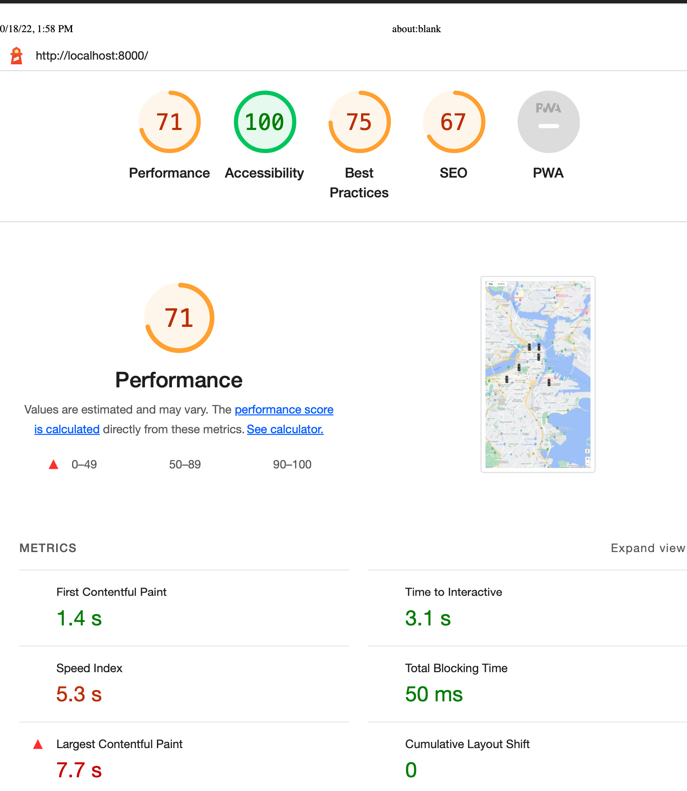
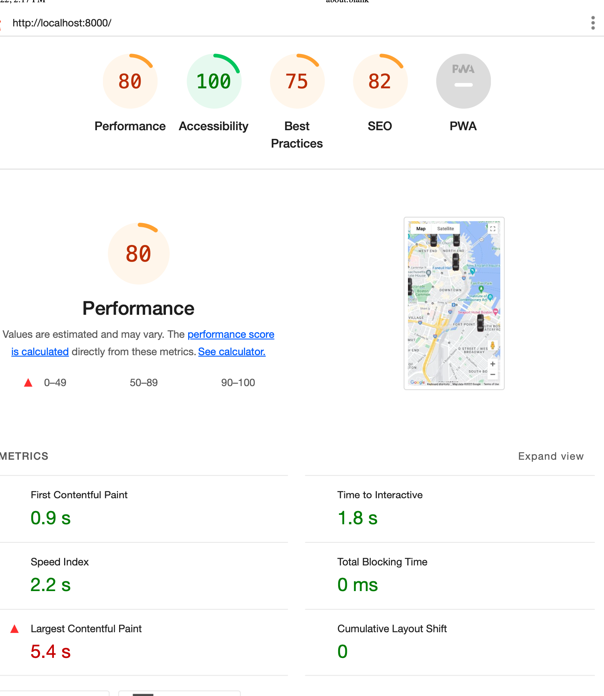

# lab 8 pt 3
hours total spent around 6 hrs the first node.js part didn't take to long used to wriitng in it. python had some turns to it mostly debugging small things took longer
worked with no one
area of note: 
python code wasn't to hard to replicate from nodejs. 
some parts were even eaiser then nodejs, while others were a bit more wordy to make. 
I personally liekthe fact that python as sqlite which was simple to setup and run. postgress didn't really work for me for some reason so I just moved on. It not working is one reason why I use docker containers for db work unless I have to have a rully local version running.
I also created my own pricvate repo trav-xeno/flask-sqlite that Ming is prt of or invited to. link: https://github.com/trav-xeno/flask-sqlite

# part 2 
* All parts curently working after an os update, web browser updates and a restart. idk wha happened .
* Identify anyone with whom you have collaborated or discussed the lab: none except for email Ming, which helped me keep my sanity about my code working.
* how many hours you have spent completing the lab: 6hour+ after fixing the displaying problem it took me an hour  
* Note: would have gone beyond but too much time was on trying to make it display.  and yes I did check to zoom in and out, idk what fixed it.

## IMPORTANT: impact of performance enhancements. Provide a comparison of the performance of page with vs without optimizations. At bare minimum, provide load times and file sizes.

## starting performance
 * problems were unsed js in the polyfils file that the google docs suggested to have. 
 * unminified css/js

 

## improvments
### Process 
I got rid of the polyfil.js from teh google maps tuttorial.
moved js to teh bottom, and minified css nad JS. This

